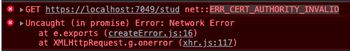
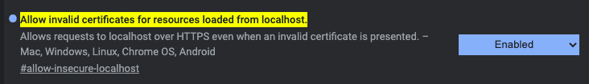

# WEBAPI GET
1. 到Controllers目錄下新增一個檔案，取名為StudController.cs
   >在Controllers的每一個檔案名稱後置都會有一個Controller，務必注意。例如TeaController.cs
2. 將下列程式輸入  
   ```csharp
   using Microsoft.AspNetCore.Mvc;
   using Microsoft.AspNetCore.Cors;

   namespace DemoCore6.Controllers;

   [ApiController]
   [Route("[controller]")]
   public class StudController : ControllerBase
   {
      [EnableCors("PublicPolicy")]
      [HttpGet]
      public IActionResult GetName()
      {
         return Ok("airmanx");
      }
   }
   ```  
3. 至左側打開Program.cs檔，找到```var app = builder.Build();```的位置，於該行上方加入此程式碼  
   ```csharp
   builder.Services.AddCors(options => {
    options.AddPolicy("PublicPolicy",
                    builder => builder.AllowAnyOrigin().AllowAnyMethod().AllowAnyHeader());
   });
   ```  
   在該行下方加入此程式碼  
   ```csharp
   app.UseCors();
   ```  
4. 啟動執行專案，讓webapi運作起來。  
5. 我們另外再開一個html檔寫個javascript用axios來連線這個webapi看看  
   ```html
   <html>
      <head>
         <script src="https://cdn.jsdelivr.net/npm/axios/dist/axios.min.js"></script>
      </head>
      <body>
         <script>
            axios.get("https://localhost:7049/stud").then(res=>{
                  alert(res.data);
            })
         </script>
      </body>
   </html>
   ```
6. 順利的話，就可以在畫面上看到從webapi抓回來的字串。  
7. 另外如果是使用chrome，在axios連線自發憑證的網址時會抛出錯誤訊息  
     
   解決方法，在chrome網址列輸入```chrome://flags/#allow-insecure-localhost```,將第一個選項啟動  
     
8. 補充關於第3點，如果要限制源頭存取的話，可以使用下列程式碼來定義，例如  
   ```csharp
   builder.Services.AddCors(options =>
   {
      options.AddPolicy("PublicPolicy",
         builder => builder.AllowAnyOrigin().AllowAnyMethod().AllowAnyHeader());
      options.AddPolicy("StustPolicy",
         builder =>
         {
            builder.WithOrigins("https://localhost:5500", 
            "https://webap.stust.edu.tw", "https://portal.stust.edu.tw")
            .AllowAnyHeader()
            .AllowAnyMethod();
         });
   });
   ```  

   ### [上一頁 WEBAPI腳手架](腳手架.md)
   

