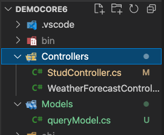

# WEB API GET 傳參
1. 這裡介紹兩種方式，首先至專案建立一個Modles目錄，於目錄中建立一個`queryModel.cs`檔  
  
2. 於`queryModles.cs`加入程式碼  
   ```csharp
    namespace DemoCore6.Models;
    public class queryModel
    {
        public string? name {get;set;}
        public int age{get;set;}
    }
   ```  
3. 打開之前在目錄Controllers做的`StudControllers.cs`檔，加入程式碼  
   ```csharp
    [EnableCors("PublicPolicy")]
    [HttpGet("query")]
    public IActionResult GetNameBy([FromQuery] Models.queryModel query)
    {
        return Ok($"name:{query.name},age:{query.age}");
    }
   ```  
4. 好了，專案執行跑起來，接下來寫一段javascript測試一下  
    ```html
    <script>
        axios.get("https://localhost:7049/stud/query")
        .then(res => {
            alert(res.data);
        });
    </script>
    ```  
5. 這是第一種方式，你也可以開個瀏覽器在網址列輸入`https://localhost:7049/stud/query?name=airmanx&age=18`也可以得到資料  
6. 接下來第二種方式，打開在Controllers的`StudControllers.cs`檔，再加入程式碼  
   ```csharp
    [EnableCors("PublicPolicy")]
    [HttpGet("query/name/{name}/age/{age}")]
    public IActionResult GetNameBy2(string name,int age)
    {
        return Ok($"name:{name},age:{age}");
    }
   ```  
7. 好了，一樣再把專案執行起來，寫一段javascript測試一下  
   ```html
   <script>
        axios.get("https://localhost:7049/stud/query/name/airmanx/age/18")
            .then(res => {
                alert(res.data);
            });
    </script>
   ```  

### [上一頁 WEB API GET](get.md)  
### [下一頁 DataAnnotations](dataAnnotations.md)


