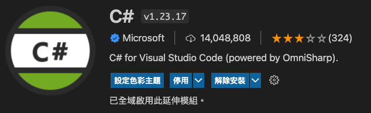
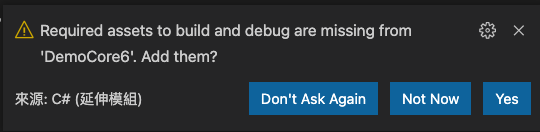
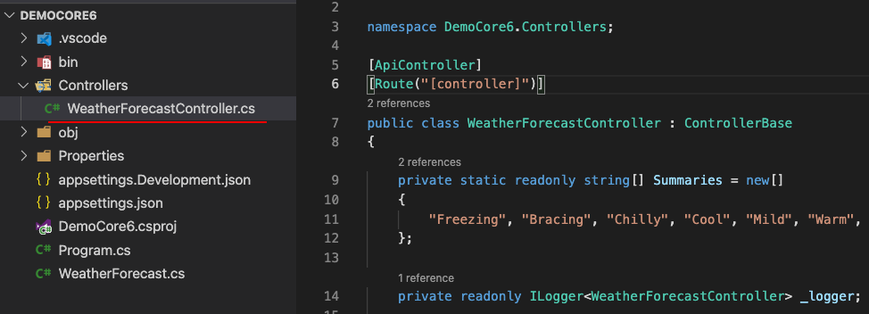
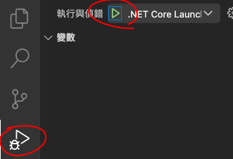
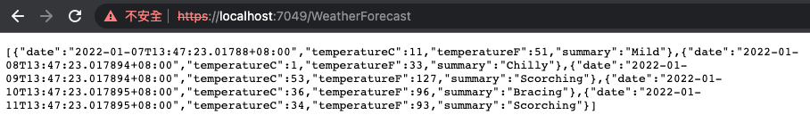

# 建立webapi腳手架

1. 安裝core6的環境，先至 [dotnet sdk download](https://dotnet.microsoft.com/en-us/download)下載sdk並安裝。
2. 安裝vscode擴充，C#  
   
3. 打開vscode，開一個新目錄，在終端機裡輸入 `dotnet new webapi` 建立起core6 webapi的腳手架
4. 建立成功後，隨便選一個檔案，則會出現詢問你是否建立debug的相關檔案，選擇 `yes`  
   
5. 可以看一下左側的檔案總管的專案結構，點一下在Controllers的WeatherForecastController.cs檔案，看一下這個檔案的結構。將來各位都是透過這種結構去開發webapi。  
   
6. 我們開始來試試看，啟動這個專案。  
   
7. 瀏覽器被開啟後，在網址列輸入`https://localhost:7049/WeatherForecast`  
   
8. 我們可以看到webapi己經把結果透過json的格式輸出至前端。  

### [下一頁 WEBAPI GET](get.md)